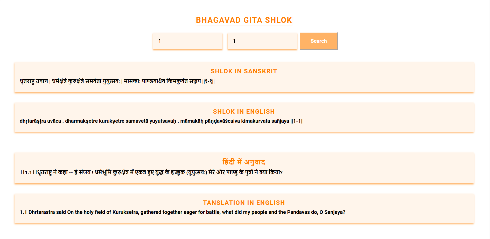

# Bhagavad Gita Shlok 



## Overview

The Bhagavad Gita Shlok Project is a web application that leverages the Bhagavad Gita API to display and explore verses (shlokas) from the Bhagavad Gita. This project aims to provide users with an immersive experience to read, search, and understand the profound teachings of the Bhagavad Gita.

## Features

- Display Bhagavad Gita verses by chapter and verse number.
- Search for specific verses using keywords.
- Explore translations in both Sanskrit and English.
- Responsive design for a seamless experience across devices.

## Demo

[link_to_live_project_webpage](https://ankursharma1302.github.io/BhagavadGitaShlok/)

## Technologies Used

- HTML5
- CSS3
- JavaScript
- Bhagavad Gita API

## Installation

1. Clone the repository:

   ```bash
   git clone https://github.com/AnkurSharma1302/BhagavadGitaShlok.git
    ```
2. Change into the project directory.
```bash
    cd BhagavadGitaShlok
```
3. Open the`index.html` file in your browser.

## Usage
1. Visit the live demo link or run the project locally.
2. Explore Bhagavad Gita shlokas by selecting a chapter and verse.
3. Use the search functionality or press 'Enter' to find specific shlokas by keywords.
4. Read the translations in both Sanskrit and English.

## API Integration
The Bhagavad Gita Shlok Project utilizes the Bhagavad Gita API to fetch shlokas dynamically. No API key is required for accessing the public API.
